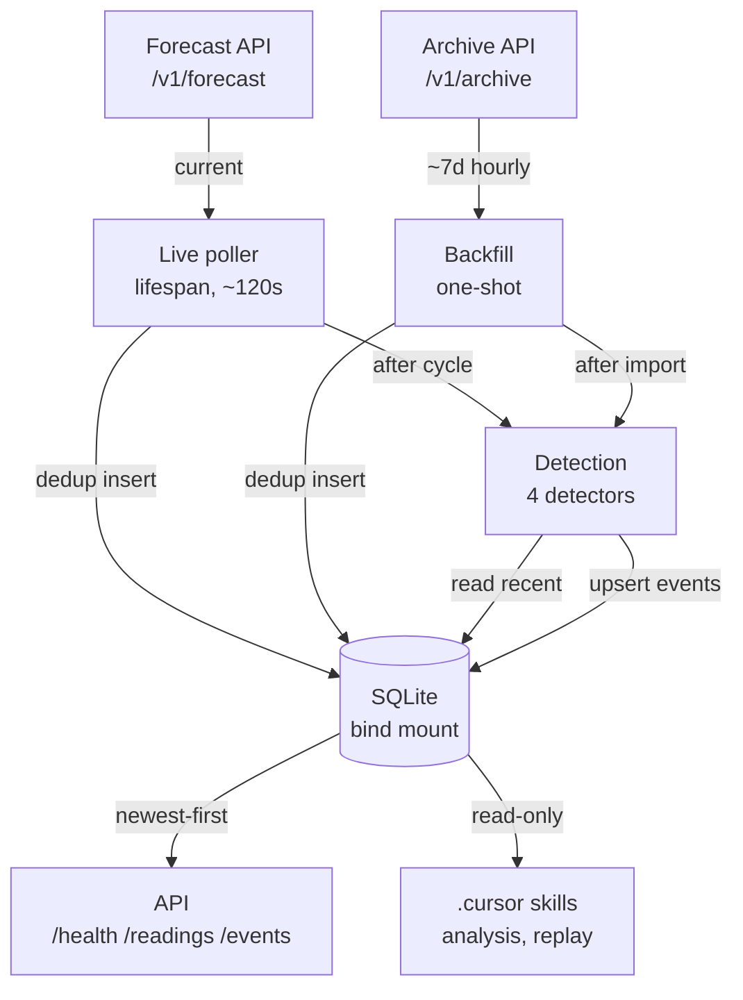

# WatchAgent

A weather-monitoring service that polls three Canadian cities (Ottawa, Toronto,
Vancouver), decides when something notable has happened in the data, and exposes
readings and detected events through a REST API.

## Design decisions at a glance

| Decision | Why | Tradeoff |
| --- | --- | --- |
| Raw `sqlite3`, no ORM | Explicit, showcaseable schema; dedup enforced as a DB constraint; dependency-light | Hand-written queries; less portable |
| In-process poller (FastAPI lifespan) | Single writer, no orchestration race, simplest at this scale | No process isolation if the poller misbehaves |
| MAD over standard deviation | Robust to outliers in a small per-city sample — one freak reading can't poison the baseline | Less familiar than a z-score |
| Compound events as co-occurrence, not a score | Every event records a defensible human-readable "why" | Won't name multi-field patterns it wasn't designed for |
| SQLite on a bind mount, not a named volume | Host-run analysis skills read the same DB the container writes | Slightly less Docker-idiomatic |

## Architecture



The live poller (an asyncio task in the API's lifespan) fetches each city from
Open-Meteo's forecast API, dedup-inserts readings into SQLite, then runs the
detection pipeline over recent history and upserts any events. The one-shot
backfill does the same against the archive API to seed ~7 days at once. The
three read endpoints and the host-run `.cursor` skills both read the single
bind-mounted SQLite file — one writer, many readers.

### Data Model

Two hand-written tables (`app/storage/db.py`):

```sql
CREATE TABLE IF NOT EXISTS readings (
    id INTEGER PRIMARY KEY AUTOINCREMENT,
    city TEXT NOT NULL,
    observed_at TEXT NOT NULL,
    fetched_at TEXT NOT NULL,
    temperature_2m REAL,
    apparent_temperature REAL,
    precipitation REAL,
    wind_speed_10m REAL,
    weather_code INTEGER,
    UNIQUE(city, observed_at)
);
```

```sql
CREATE TABLE IF NOT EXISTS events (
    id INTEGER PRIMARY KEY AUTOINCREMENT,
    city TEXT NOT NULL,
    event_type TEXT NOT NULL,
    severity TEXT,
    started_at TEXT NOT NULL,
    ended_at TEXT,
    reason TEXT NOT NULL,
    detail TEXT,
    UNIQUE(city, event_type, started_at)
);
```

Dedup is enforced by these `UNIQUE` constraints at the database layer (not in
application code), which is the concrete reason raw SQL was chosen over an ORM.

## Setup & Running

Docker is the primary path:

```bash
git clone <repo>
cp .env.example .env        # optional — a missing .env is tolerated
docker compose up --build
```

The API is then at `http://localhost:8000` (interactive docs at `/docs`).

### Seeing detected events

Events are detected from **real readings** either way — but on a fresh start the
DB is empty. The poller fetches every 120 s yet dedups on `(city, observed_at)`,
and the temperature detector needs at least 10 readings in its ~2-day baseline
window before it can fire (cold-start guard). So on a calm fresh start `/events`
is correctly empty until enough history accrues. (Precipitation and apparent-gap
events can still fire immediately on a qualifying reading.)

To populate a realistic dataset immediately, run the one-shot backfill. It pulls
~7 days of real historical readings from the Open-Meteo archive and runs
detection over them:

```bash
docker compose exec app python -m app.backfill
```

The backfill just supplies a week of history at once instead of waiting for the
live poller to accumulate it.

### Local (non-Docker)

```bash
pip install .
uvicorn app.main:app --port 8000      # serves on http://localhost:8000
python -m app.backfill                # optional: seed history
```

Locally the DB defaults to `./data/watchagent.db` (parent dir auto-created);
Docker overrides this to `/data/watchagent.db` on the bind mount.

## API Reference

All list endpoints take an optional `city` filter and a `limit` (default 50,
must be 1–1000; out-of-range values are rejected with HTTP 422, not clamped) and
return results most-recent-first.

**`GET /health`** → fixed contract:

```bash
curl http://localhost:8000/health
# {"status":"ok","readings_stored":507,"events_stored":24}
```

**`GET /readings?city=&limit=`** → `{"readings":[...]}`; each reading carries
`id, city, observed_at, fetched_at, temperature_2m, apparent_temperature,
precipitation, wind_speed_10m, weather_code`.

```bash
curl "http://localhost:8000/readings?city=Ottawa&limit=5"
```

**`GET /events?city=&limit=`** → `{"events":[...]}`; same semantics. Sample:

```bash
curl "http://localhost:8000/events?city=Vancouver&limit=10"
```

```json
{
  "events": [
    {
      "id": 25,
      "city": "Vancouver",
      "event_type": "temp_anomaly",
      "severity": "major",
      "started_at": "2026-05-27T11:00",
      "ended_at": "2026-05-28T11:00",
      "reason": "Vancouver temperature 15.9°C is 8.9 MAD above the 2-day median of 11.9°C (severity: major).",
      "detail": {
        "mad_distance": 8.88,
        "baseline_median": 11.95,
        "scaled_mad": 0.445,
        "window_size": 10
      }
    }
  ]
}
```

## Running the Tests

```bash
pip install ".[dev]"
pytest
```

The suite covers dedup/idempotency, detection fire/no-fire (synthetic
sequences), API shape/ordering/limit validation, config parsing, and both
`.cursor` skills. All external HTTP is mocked (httpx `MockTransport`) and
`POLLER_ENABLED=false`, so tests make **no network calls** and each runs against
an isolated temporary SQLite DB.

## Technology Choices

- **FastAPI** — async-native, so the background poller and the API share one
  event loop with no extra threads; Pydantic-backed query validation (the
  `limit` bounds) and auto-generated OpenAPI docs at `/docs` come free. Routers
  return plain dicts (no response models), keeping the response shape obvious.
- **Raw `sqlite3` (no ORM)** — the schema is small enough that explicit SQL is
  clearer than an ORM, showcases the dedup `UNIQUE` constraints directly, and
  adds no DB-driver dependency.
- **In-process poller (FastAPI lifespan)** — a single in-process writer means no
  cross-process locking and no orchestration race; simplest correct design at
  this scale.
- **SQLite + bind mount** — persists across `docker compose down && up` *and*
  lets the host-run analysis skills read the exact same DB file the container
  writes.

## Event Detection Design

Collecting data is the easy part; deciding what matters is the work. The guiding
principle: different fields carry signal differently, so each is detected with
the method that fits its statistical character — never a single global
threshold. A naive `temperature > 30°C` is the shallow failure mode this avoids:
"notable" must be defined per city and per field. Detectors are **pure
functions** (readings in, events out, no I/O), making them trivial to unit-test.

1. **Temperature anomaly** — a per-city rolling ~2-day baseline (48 readings);
   deviation is measured against the **median** in MAD units scaled by 1.4826
   (sigma-comparable). Severity bands at scaled-MAD distance 3 / 4.5 / 6
   (minor / moderate / major). MAD is chosen over std-dev for robustness on a
   small sample. A cold-start guard suppresses firing below 10 baseline
   readings; the baseline is **frozen at onset** so an ongoing spike can't
   normalize itself; a max-duration auto-close (~24 readings) then re-baselines
   so a sustained regime shift becomes the new normal.
2. **Precipitation** — detected as an **onset** (not an anomaly), because precip
   is zero most of the time and MAD is meaningless there. Severity by amount:
   light / moderate (≥2.0 mm) / heavy (≥7.6 mm).
3. **Frontal passage** — fires only when a temp drop (≥5 °C), a wind spike
   (≥15 km/h), **and** a precipitation onset co-occur within 3 consecutive
   readings (~3 h). It is an explainable **co-occurrence**, deliberately not a
   weighted score, so every event has a defensible "why" (severity is therefore
   `None`).
4. **Apparent-temperature gap** — a gap ≥7 °C between actual and feels-like flags
   wind-chill/humidity that the raw temperature misses (severity `None`).

**State model:** every detector uses **onset + close** — it fires once on onset,
stays silent while the condition persists, and stamps `ended_at` when conditions
return to normal. This avoids re-firing on every poll. Persistence is idempotent:
events dedup on `(city, event_type, started_at)` via `upsert_event`, so
recomputing each cycle never duplicates a row and a later close updates
`ended_at` in place.

**In practice:** the `data-analysis` skill's `near-miss` diagnostic surfaces
windows where exactly 2 of the 3 frontal signals crossed their thresholds but not
the third. In an Ottawa window on 2026-05-29 the temperature dropped 6.1 °C and
precipitation began, but wind rose only 3.7 km/h — below the 15 km/h threshold —
so no `frontal_passage` fired; the missing signal was the wind spike. The
co-occurrence requirement correctly withheld a frontal label from what was just a
rainy cooldown lacking the wind shift, proving the thresholds do real
discriminating work rather than rubber-stamping any cool, wet afternoon.

## Cursor Setup

**Rules** (`.cursor/rules/`, each glob-scoped with `alwaysApply: false` for
deterministic, context-efficient activation):

- `poller-error-handling` (`app/poller/**`) — a failed city fetch logs a WARNING
  and is skipped; one bad response never aborts the cycle or crashes the loop.
- `event-record-schema` (`app/detection/**`, `app/storage/events.py`) — the
  `Event` fields, the `(city, event_type, started_at)` dedup identity, and the
  upsert persistence contract.
- `storage-sql-discipline` (`app/storage/**`) — stdlib `sqlite3` only, hand-written
  `CREATE TABLE IF NOT EXISTS`, parameterized queries, DB-layer dedup, and the
  detection-reads-oldest-first / API-reads-newest-first split.
- `api-endpoint-conventions` (`app/routers/**`) — shared `city`/`limit`/named-key
  shape, repository-only reads, and the pinned `/health` contract.
- `testing-conventions` (`tests/**`) — network-free tests, isolated SQLite, and
  synthetic detector sequences asserting exactly what does and does not fire.

**Agent** (`.cursor/agents/detection-logic-reviewer`) — a **read-only** reviewer
scoped to `app/detection/`. It is intentionally read-only: a reviewer should
surface and explain convention violations, not silently rewrite code. It can
invoke the `data-analysis` skill to ground a threshold critique in real event
counts.

**Skills** (`.cursor/skills/`):

- `data-analysis` — queries stored data (`summary` / `trends` / `compare` /
  `near-miss`). This is the required graded skill; it runs standalone via its CLI
  (`python .cursor/skills/data-analysis/scripts/analyze.py <subcommand>`),
  read-only (`PRAGMA query_only = ON`).
- `detection-replay` — a dry run that re-runs the **real** detectors over stored
  readings to show what *would* fire under the current logic, persisting nothing.

## Known Limitations & Tradeoffs

These are deliberate, defensible boundaries, each with a known fix path.

- **Stateless recompute over a bounded window.** Detection re-runs each cycle over
  the most recent ~72 readings/city (~3 days), with no detector state persisted
  across cycles. A single condition that persists *beyond* that window could
  re-emit an onset at the window edge. Acceptable because the window is sized well
  beyond normal event durations, and the fix (seeding detector state from
  persisted open events) is understood.
- **Cross-city ordering by local clock.** `observed_at` is stored as Open-Meteo
  local time (`timezone=auto`), so an *unfiltered* newest-first list mixes cities'
  local clocks. Per-city ordering — the common query — is exactly correct.
- **A genuine ~3-day data gap.** The archive backfill ends ~3 days ago (ERA5
  reanalysis latency) while live polling starts now, leaving a gap. It is left as
  honest no-data rather than imputed, because fabricating readings would bias the
  anomaly baselines.
- **Precipitation moderate threshold = 2.0 mm.** Deliberately deviates from the
  textbook 2.5 mm to match the challenge's worked example; heavy = 7.6 mm is the
  standard 0.30 in/h boundary.

### Possible future hardening

These would harden a production deployment and were consciously out of scope at
this scale and time budget, not overlooked.

- **Non-root container user** — defense-in-depth; deferred to avoid bind-mount
  file-ownership complications at this scale.
- **Detection/DB work off the event loop** (`asyncio.to_thread`) — negligible at
  3 cities, but would matter as city count and history grow.
- **Reject non-standard JSON tokens** (`NaN`/`Infinity`) defensively — Open-Meteo
  emits `null`, not `NaN`, so the real-world risk is low.
- **Docker `HEALTHCHECK`** hitting `/health` — would let the orchestrator
  observe liveness directly.
